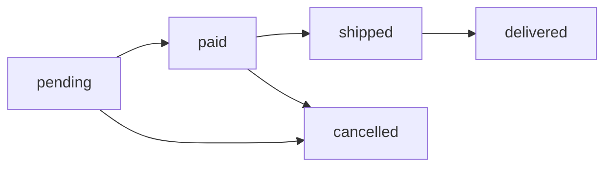

## Category

### slug
### slug
- Généré automatiquement via un service Slugger #TODO
- Format: minuscules, tirets, sans accents
- Exemple: "Vêtements Homme" → "vetements-homme"
- Utilisé dans les routes: `/categorie/{slug}`

## Order

### orderNumber
- **Format**: `ORD-{YYYYMMDD}-{séquence 5 chiffres}`
- **Génération**: Automatique via un service OrderNumberGenerator
- **Exemple**: ORD-20241125-00042
- **Usage**: 
  - Affiché sur la facture
  - Utilisé pour le tracking
  - Référence pour le support client

### status - Workflow de commande


#### États possibles:
1. **pending**: Commande créée, en attente de paiement
2. **paid**: Paiement validé, en cours de préparation
3. **shipped**: Expédiée, en transit
4. **delivered**: Livrée au client
5. **cancelled**: Annulée (possible avant shipped)

#### Transitions autorisées:
- `pending` → `paid` (paiement validé)
- `pending` → `cancelled` (annulation client/timeout)
- `paid` → `shipped` (colis expédié)
- `paid` → `cancelled` (annulation admin uniquement)
- `shipped` → `delivered` (livraison confirmée)

#### Business Rules:
- **Annulation impossible** après expédition
- **Remboursement auto** si cancelled après paid
- **Email automatique** à chaque changement de statut

### totalAmount
- **Calcul**: `SUM(OrderItem.totalPrice)` au moment de la commande
- **Historisation**: Ne change JAMAIS après création
- **Devise**: EUR uniquement (pour l'instant)
- **Précision**: 2 décimales
- **Important**: Stocké pour garder le prix exact même si les produits changent

## OrderItem

### unitPrice ⚠️ IMPORTANT
- **Source**: Copié depuis `Product.price` à la création
- **Historisation**: Ne doit JAMAIS être modifié après création
- **Raison**: Garder le prix exact payé par le client
- **Exemple**: Si le produit passe de 19.99€ à 24.99€, les anciennes commandes gardent 19.99€

### totalPrice
- **Formule**: `unitPrice × quantity`
- **Stockage**: Dénormalisé pour performance
- **Calcul**: 
```php
  $totalPrice = bcmul($unitPrice, (string)$quantity, 2);
```
- **Utilisation**: Somme pour obtenir Order.totalAmount

## Product

### price
- **Type**: decimal(10,2) → string en PHP
- **Format**: 2 décimales obligatoires
- **Devise**: EUR (euros)
- **Important**: 
  - NE PAS utiliser de float pour les calculs
  - Utiliser BCMath ou une library comme brick/money
  - Exemple: "19.99", "1234.50"

### stock
- Décrémenté automatiquement lors de la validation d'une commande
- Si stock = 0 → produit marqué "en rupture"
- TODO: Implémenter un système d'alerte pour stock < seuil

### isActive
- `true`: Produit visible dans le catalogue
- `false`: Produit masqué (soft delete)
- Utile pour:
  - Produits temporairement indisponibles
  - Produits en préparation
  - Garder l'historique des commandes passées

## Cart

### Cart Business Rules
- **Création**: Automatique lors de l'inscription
- **Suppression**: Cascade avec l'utilisateur
- **Conversion**: Transformé en Order lors du checkout
- **Durée de vie**: Persistant (pas de panier anonyme)

## CartItem

### quantity
- **Validation avant ajout**: Vérifier stock disponible
- **Si quantity = 0**: Supprimer le CartItem
- **Mise à jour**: Via méthodes increment/decrement
- **Max**: Ne peut pas dépasser Product::stock

## Address

### isDefault
- **Contrainte**: 1 seule adresse par défaut par utilisateur
- **Logique**: 
  - Si on met isDefault=true sur une adresse
  - Toutes les autres adresses du même user passent à false
- **Implémentation**: Via un EventListener ou méthode dédiée
- **Usage**: Pré-rempli automatiquement au checkout