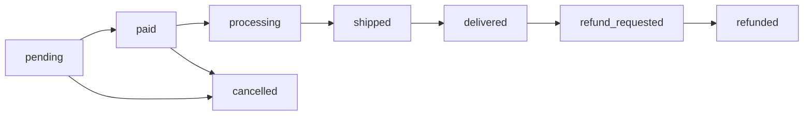

# Orders Domain

## Order

### Fields

#### Timestamps

-   **createdAt**: `DateTimeImmutable` - Créée automatiquement à la création de la commande
-   **updatedAt**: `DateTimeImmutable | null` - Mise à jour automatique lors de modifications
-   **deliveredAt**: `DateTimeImmutable | null` - Définie automatiquement quand statut → `delivered`
-   **refundRequestedAt**: `DateTimeImmutable | null` - Définie quand client demande un remboursement

#### Relationships

-   **user**: `ManyToOne(User)` - Client propriétaire de la commande
-   **shippingAddress**: `ManyToOne(Address)` - Adresse de livraison
-   **billingAddress**: `ManyToOne(Address)` - Adresse de facturation
-   **items**: `OneToMany(OrderItem)` - Articles de la commande (cascade delete)

### reference

-   **Format**: `ORD-{YYYYMMDD}-{séquence 5 chiffres}`
-   **Génération**: Automatique via un service referenceGenerator
-   **Exemple**: ORD-20241125-00042
-   **Usage**:
    -   Affiché sur la facture
    -   Utilisé pour le tracking
    -   Référence pour le support client

### status - Workflow de commande



#### États possibles:

1. **pending**: Commande créée, en attente de paiement
2. **paid**: Paiement validé, commande confirmée
3. **processing**: En cours de traitement/préparation
4. **shipped**: Expédiée, en transit
5. **delivered**: Livrée au client
6. **cancelled**: Annulée (avant paiement ou par admin)
7. **refund_requested**: Demande de remboursement initiée
8. **refunded**: Remboursement effectué

#### Transitions autorisées:

-   `pending` → `paid` (paiement validé)
-   `pending` → `cancelled` (annulation client/timeout)
-   `paid` → `processing` (commande en préparation)
-   `processing` → `shipped` (colis expédié)
-   `shipped` → `delivered` (livraison confirmée)
-   `delivered` → `refund_requested` (client demande remboursement)
-   `refund_requested` → `refunded` (remboursement approuvé et traité)
-   `refund_requested` → `delivered` (remboursement refusé, retour à livré)

#### Business Rules:

-   **Annulation**: Possible seulement au statut `pending`
-   **Délai d'annulation**: 24h après création de la commande
-   **Après annulation**: Impossible de la réactiver (statut terminal)
-   **Remboursement**: Possible uniquement au statut `delivered`
-   **Délai de remboursement**: 14 jours après livraison
-   **Une seule demande de remboursement**: Impossible de demander un remboursement si une demande existe déjà
-   **Remboursement refusé**: Possible de revenir au statut `delivered` depuis `refund_requested`
-   **Statuts terminaux**: `cancelled` et `refunded` ne permettent plus aucune transition
-   **Email automatique** à chaque changement de statut //TODO

### totalAmount

-   **Calcul**: `SUM(OrderItem.totalPrice)` au moment de la commande
-   **Historisation**: Ne change JAMAIS après création
-   **Devise**: EUR uniquement (pour l'instant)
-   **Précision**: 2 décimales
-   **Important**: Stocké pour garder le prix exact même si les produits changent

### shippingAddress & billingAddress

-   **Type**: `ManyToOne(Address)`
-   **Obligatoires**: Oui, snapshot de l'adresse au moment de la commande
-   **Raison**: Garder l'historique même si l'adresse utilisateur est modifiée

### refundReason

-   **Type**: `TEXT | null`
-   **Utilisation**: Motif du remboursement saisi par le client
-   **Lié à**: Statut `refund_requested`

## OrderItem

### Fields

-   **quantity**: `int` - Nombre d'articles commandés
-   **unitPrice**: `DECIMAL(10,2)` - Prix unitaire au moment de l'achat
-   **totalPrice**: `DECIMAL(10,2)` - Prix total (quantity × unitPrice)
-   **product**: `ManyToOne(Product)` - Le produit commandé
-   **parentOrder**: `ManyToOne(Order)` - La commande parente

### unitPrice ⚠️ IMPORTANT

-   **Source**: Copié depuis `Product.price` à la création
-   **Historisation**: Ne doit JAMAIS être modifié après création
-   **Raison**: Garder le prix exact payé par le client
-   **Exemple**: Si le produit passe de 19.99€ à 24.99€, les anciennes commandes gardent 19.99€

### totalPrice

-   **Formule**: `unitPrice × quantity`
-   **Stockage**: Dénormalisé pour performance
-   **Calcul**:

```php
  $totalPrice = bcmul($unitPrice, (string)$quantity, 2);
```

-   **Utilisation**: Somme pour obtenir Order.totalAmount

## Workflows & Operations

### Stock Management

-   **Stock Decrement Timing**: Stock décrémenté automatiquement quand la commande passe au statut `paid` #TODO: check
-   **Reverse Stock**: Pas de remise en stock lors d'annulation ou de remboursement #TODO: check

### API Endpoints

-   **GET** `/api/orders` - Lister les commandes de l'utilisateur (paginated)
-   **GET** `/api/orders/{id}` - Détail d'une commande
-   **PATCH** `/api/orders/{id}/cancel` - Annuler une commande (si possible)
    -   Input: `OrderCancelInputDto`
-   **POST** `/api/orders/{id}/refund` - Demander un remboursement
    -   Input: `OrderRefundInputDto` (reason, refundAmount)

### Automatic Lifecycle Events

-   ✅ Email envoyé automatiquement à chaque changement de statut (TODO: implémenter)
-   ✅ `deliveredAt` défini automatiquement au passage à `delivered`
-   ✅ `refundRequestedAt` défini automatiquement au passage à `refund_requested`
-   ✅ Reference générée automatiquement au formatage (BeforePersist lifecycle)
-   ✅ Stock décrémenté au passage à `paid`

## Data Integrity

### Historical Data Preservation

-   **Order prices**: Les prix sont figés au moment de la création pour l'audit
-   **Product prices**: Chaque OrderItem garde le prix produit au moment de la commande
-   **Addresses**: Snapshot de l'adresse au moment de la commande (même si adresse utilisateur change)
